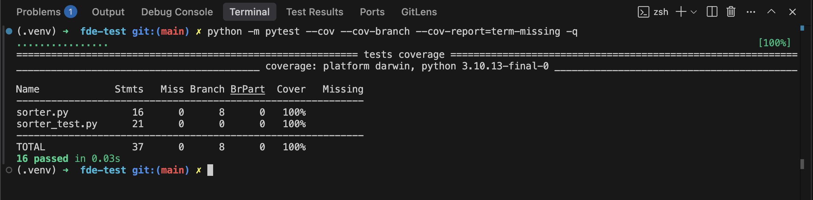

#  FDE Technical Screen  
Package-Sorting Function (Python)

This repo contains a **clean solution** to the “robotic-arm package dispatcher” exercise.  

---

## 📁 Contents

| File | Purpose |
|------|---------|
| `sorter.py` | Implementation & input validation |
| `sorter_test.py` | Parametrised `pytest` suite with edge-case coverage |
| `requirements.txt` | Minimal runtime / dev deps (`pytest` only) |
| `.venv/` | local virtual-env — not committed |

---

## 🚀 Quick start

```bash
# 1 – enter on the folder
cd fde-test

# 2 – create an isolated Python environment (3.10+ recommended)
python -m venv .venv
source .venv/bin/activate          # Windows: .venv\Scripts\activate

# 3 – install the single dependency
pip install -r requirements.txt

# 4 – run the test suite
pytest -q
```

### 🧪 Coverage

```bash
# All lines are currently covered. Generate the report with:
pytest --cov --cov-branch --cov-report=term-missing
```
